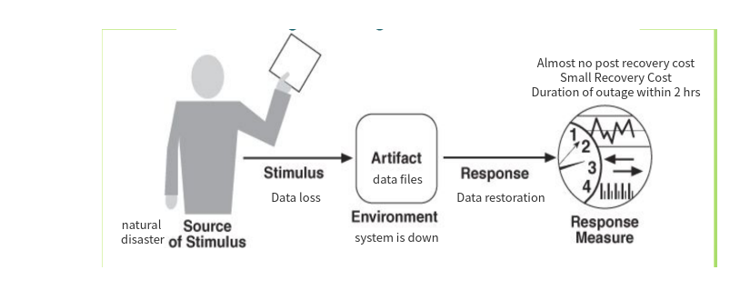
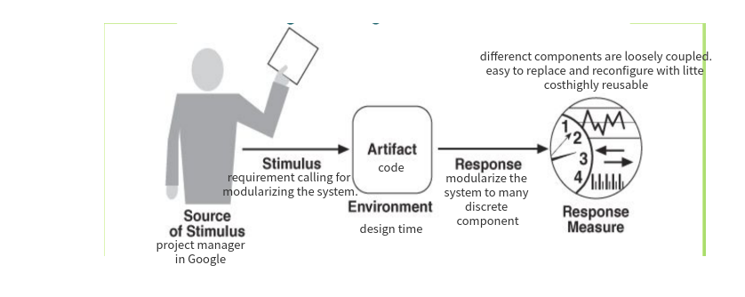
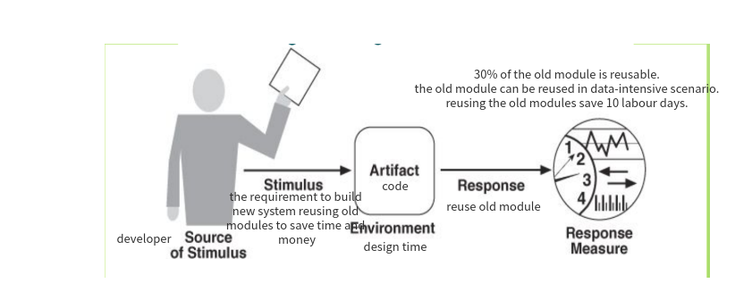

<h1 style="font-size: 50px;">Software System Design - Architecture</h1>

Assignment1

<strong>Department: </strong> Software Engineering

<strong>Name: </strong> Lifan Sun
 

<strong>ID: </strong>201250181

  

 

## Task1: Quality Attribute Scenarios   
<strong>Reliability & Recoverability</strong> 

### Reliability General Scenario

| Portion of Scenario | Possible Values                                              |
| ------------------- | ------------------------------------------------------------ |
| Stimulus            | Events that could potentially cause a system failure, such as invalid inputs, resource exhaustion, environmental changes. |
| Stimulus Source     | Entities that generate failure-inducing stimuli, e.g. users, hardware, third-party systems. |
| Response            | one or many of the following: 1. Failover: Switching to redundant components upon failure to maintain function. 2. Diagnosis: Investigating issues to determine root causes of problems. 3. Restart: Stopping and restarting malfunctioning software processes. |
| Response Measure    | 1. Uptime Ratio: the percentage of time that a system is functioning properly. 2. Mean Time Between Failure 3. Failure Rate: the frequency with which a system or component fails. |
| Environment         | start up, normal operation, shutdown, overloaded operation   |
| Artifact            | Critical system components that need to function without failure. |

### Reliability Concrete Scenario

 

### Recoverability General Scenario

| Portion of Scenario | Possible Values                                              |
| ------------------- | ------------------------------------------------------------ |
| Stimulus            | The specific failure event, data corruption, infrastructure damage, etc. |
| Stimulus Source     | An unforeseen failure or major system issue that compromises  data or functionality, requiring recovery to restore service. |
| Response            | one or many of the following: 1. Diagnosis 2. Repair 3. Data Restoration 4. Restart to a consistent state |
| Response Measure    | 1. Duration of Outage 2. Data/Functionality Loss 3. Mean Time to Recover 4. Recovery Cost 5. Post Recovery Defects |
| Environment         | The system is in a malfunctioning state                      |
| Artifact            | Critical System Component (may be code, hardware, data, service, etc) to be recovered. |

### Recoverability Concrete Scenario

 

<strong>Modularity & Reusability</strong>

### Modularity General Scenario

| Portion of Scenario | Possible Values                                              |
| ------------------- | ------------------------------------------------------------ |
| Stimulus            | The requirements that demand making the system modular.      |
| Stimulus Source     | The stakeholders that determine the requirements, such as customers, managers, end users, etc. |
| Response            | Components are redesigned as loosely coupled modules focused on single capabilities. |
| Response Measure    | 1. The extent of coupling between different components. 2. The cose to modify, replace or reconfigure modules without major impact. 3. Reusability of modules in alternative configurations |
| Environment         | Design time.                                                 |
| Artifact            | Code                                                         |

### Modularity Concrete Scenario

### Reusability General Scenario

| Portion of Scenario | Possible Values                                              |
| ------------------- | ------------------------------------------------------------ |
| Stimulus            | The need to reuse existing components instead of reinventing the wheel. |
| Stimulus Source     | developer                                                    |
| Response            | 1. Analyzing the system, extract and modularize some parts which should be reusable and redesign the system. 2. reuse past code to build new modules. |
| Response Measure    | 1. Percentage of system composed of reusable elements 2. Number of contexts in which elements can be reused, that is, how well can this component to be reused. 3. Cost/time savings by reusing rather than rebuilding components. |
| Environment         | design time                                                  |
| Artifact            | Code                                                         |

### Reusability Concrete Scenario

## Task2: Tactics

| Strategy            | Tactic                 | Impact on Reliability                            | Impact on Recoverability                                     | Impact on Modularity | Impact on Reusability |
| ------------------- | ---------------------- | ------------------------------------------------ | ------------------------------------------------------------ | -------------------- | --------------------- |
| Robustness Testing  | Stress Test            | Hardens system by exposing weaknesses.           | N/A                                                          | N/A                  | N/A                   |
|                     | Worst Scenario Test    | same as above                                    | N/A                                                          | N/A                  | N/A                   |
| Redundancy          | Backup Server          | Prevents single points of failure.               | Improve recovery speed.                                      | N/A                  | N/A                   |
|                     | RAID Storage           | same as above                                    | same as above                                                | N/A                  | N/A                   |
| Incremental Backups | Snapshots              | Faster recovery, prevent data loss, etc          | Allows granular restoration to recent working state.         | N/A                  | N/A                   |
|                     | Replication            | same as above                                    | same as above                                                | N/A                  | N/A                   |
| Disaster Recovery   | Redundant data centers | maintain normal operation in disaster condition. | Gets system up quickly even after a crash to limit downtime. | N/A                  | N/A                   |
|                     | Failover procedures    | same as above                                    | same as above                                                | N/A                  | N/A                   |

| Strategy        | Tactic              | Impact on Reliability                                        | Impact on Recoverability                                     | Impact on Modularity                                     | Impact on Reusability                               |
| --------------- | ------------------- | ------------------------------------------------------------ | ------------------------------------------------------------ | -------------------------------------------------------- | --------------------------------------------------- |
| Loose Coupling  | Abstraction         | N/A                                                          | N/A                                                          | Changes to one module limit impact on others.            | Easier to reuse.                                    |
|                 | Standard interfaces | N/A                                                          | N/A                                                          | same as above                                            | same as above                                       |
| Segmentation    | Microservices       | prevent faliure in one microservices to propagate to others. | failure in a microservices does not entail the restart of the whole system, making recovery faster. | Units can be modified, replaced or scaled independently. | Fine grained units are easier to be reused.         |
|                 | Componentization    | N/A                                                          | N/A                                                          | same as above                                            | same as above                                       |
| Standardization | Style guides        | N/A                                                          | N/A                                                          | N/A                                                      | New uses for existing standardized elements emerge. |
|                 | Use APIs            | N/A                                                          | N/A                                                          | N/A                                                      | same as above                                       |

| Strategy        | Tactic                         | Impact on Reliability                                        | Impact on Recoverability               | Impact on Modularity                      | Impact on Reusability                                       |
| --------------- | ------------------------------ | ------------------------------------------------------------ | -------------------------------------- | ----------------------------------------- | ----------------------------------------------------------- |
| Generalization  | Promote polymorphism           | N/A                                                          | N/A                                    | N/A                                       | Fewer variations needed and wider range of potential reuse. |
|                 | Interface Oriented Programming | N/A                                                          | N/A                                    | easier to modularize due to low coupling. | same as above                                               |
|                 | identify common requirements   | N/A                                                          | N/A                                    | easier to plan modularization.            | same as above                                               |
| Fault Detection | Exception handling             | Problems can be addressed before causing significant disruption. | N/A                                    | N/A                                       | N/A                                                         |
|                 | Error logging                  | same as above                                                | provide some information for recovery. | N/A                                       | N/A                                                         |

## Task3: Quality Attribute Debate

### Essay

>Identify the quality attributes that may relate to ‘maintainability’, such as (not limited to) ‘testability’, ‘complexity’, and ‘reusability’, and discuss their relationships with ‘maintainability’ based on your research. Describe the research you did on this task, and elaborate the reasons to support your
>argument.

**Maintainability**

**Maintainability** refers to the ease with which a system can be modified  or adjusted to changes. From my perspective, maintainability is closely  related to complexity, testability and extensibility - three quality  attributes that impact software maintenance activities. This essay will explore how these quality attributes relate to maintainability.

**Complexity and Maintainability** 
**Complexity** refers to the degree of interconnectivity and interdependence between  components in a system. Complex systems are difficult to understand,  which increases the cost of software maintenance. For example, complex  code is hard to comprehend and debug, requiring more time, budget and  effort to fix bugs - an important part of software maintenance. A study  (*Banker, Rajiv D. and Datar, Srikant M., Software Complexity and Maintainability* ) found that software complexity directly impacts maintenance costs. **In  summary**, controlling complexity promotes maintainability by reducing  maintenance costs. 

**Testability and Maintainability**
Software testing is crucial to software maintenance. **Testability** refers to the  degree to which a system supports testing. Highly testable systems  enable developers to detect more bugs efficiently, reducing the cost and effort to fix them. Poorly testable systems require more time and  resources to test and debug. **Therefore**, testability improves  maintainability by decreasing the cost of resolving issues.

**Extensibility and Maintainability** 
**Extensibility** refers to the ability to extend a system for future growth. Extending  software is an important part of maintenance. Highly extensible systems  are easy to extend without affecting other modules or requiring  retesting, saving time and resources. Adding features to poorly  extensible systems can impact other modules, requiring additional  testing and maintenance. **In summary**, extensibility enhances  maintainability by facilitating software extensions with minimal cost or effort. 

**In conclusion**, complexity, testability and extensibility are quality  attributes that significantly impact software maintenance activities. By controlling complexity, improving testability and extensibility, we can build highly maintainable software systems that can evolve and change  efficiently.

### Research Process Framework
Information was collected from Wikipedia, Google Scholar and additional scholarly  sources on software quality attributes and maintainability. An analysis  was conducted to examine how each quality attribute relates to and  impacts maintainability.

### References
[1]Banker, Rajiv & Datar, Srikant & Zweig, Dani. (1989). Software complexity and maintainability. 247-255. 10.1145/75034.75056. 

[2] Wikipedia, "Complexity." https://en.wikipedia.org/wiki/Complexity.

[3] Wikipedia, "Extensibility." https://en.wikipedia.org/wiki/Extensibility.

[4] Wikipedia, "Testability." https://en.wikipedia.org/wiki/Testability.  
